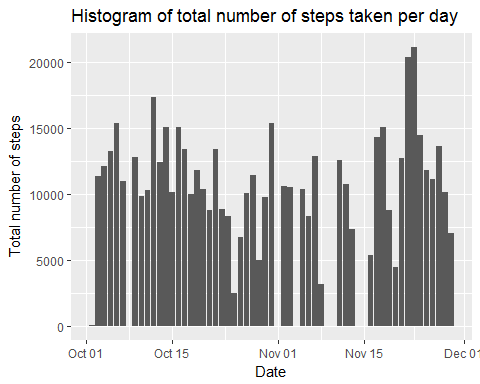
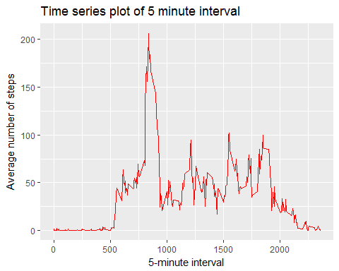
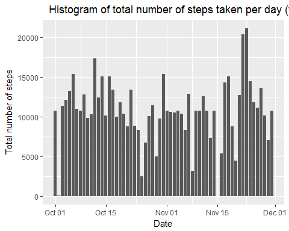
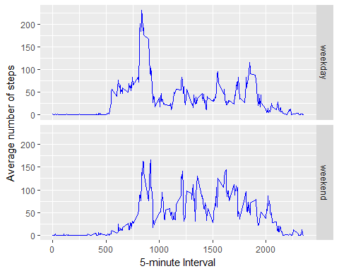

Conrad Frank 


##Loading basis packages

```r
library(readr)
library(dplyr)
library(ggplot2)
```

##Loading and preprocessing the data

```r
origin_data <- read_csv("./data/activity.csv", col_names = TRUE, na = "NA" )
```

## What is mean total number of steps taken per day?

Histogram for total number of steps /day ignoring missing values


```r
step_days <- origin_data %>%
             filter(!is.na(steps)) %>%
             group_by(date) %>%
             summarise(total.steps = sum(steps))
g <- ggplot(step_days, aes(date, total.steps))
g + geom_col() + labs(title = "Histogram of total number of steps taken per day", x = "Date", y  = "Total number of steps")
```

<!-- -->

Mean total number of steps per day

```r
mean(step_days$total.steps)
```

```
## [1] 10766.19
```

Median total number of steps per day

```r
median(step_days$total.steps)
```

```
## [1] 10765
```

## What is the average daily activity pattern?


```r
avg_steps <- origin_data %>%
             filter(!is.na(steps)) %>%
             group_by(interval) %>%
             summarise(avg.steps = mean(steps))
g1 <- ggplot(avg_steps, aes(interval,avg.steps))
g1+geom_line(color = "red", size = .6)+ labs(title = "Time series plot of 5 minute interval", x = "5-minute interval", y  = "Average number of steps")
```

<!-- -->


Which 5-minute interval, on average across all days, contains maximum number of steps?

```r
avg_steps[which.max(avg_steps$avg.steps),]
```

```
## # A tibble: 1 x 2
##   interval avg.steps
##      <int>     <dbl>
## 1      835      206.
```

## Imputing missing values

Total number of missing values (reflected as NA)

```r
sum(!complete.cases(origin_data))
```

```
## [1] 2304
```

All the missing values are filled with mean value for that 5-minute interval and created in new dataset

```r
imputed_data <- origin_data %>% 
                group_by(interval) %>% 
                mutate(imputed.steps = ifelse(is.na(steps),
                mean(steps, na.rm = TRUE), steps)) %>%
                ungroup(interval)
```
Histogram for total number of steps /day with imputed values

```r
g2 <- ggplot(imputed_data, aes(date, imputed.steps))
g2 + geom_col() + labs(title = "  Histogram of total number of steps taken per day (with imputed values)", x = "Date", y  = "Total number of steps")
```

<!-- -->

Code to calculate total number of steps per day for imputed values

```r
imputed_step_days <- imputed_data %>%
                     group_by(date) %>%
                     summarise(total.steps = sum(imputed.steps))
```

Mean total number of steps per day(imputed data)

```r
mean(imputed_step_days$total.steps)
```

```
## [1] 10766.19
```

Median total number of steps per day(imputed data)

```r
median(imputed_step_days$total.steps)
```

```
## [1] 10766.19
```
Mean values are same for both datasets, median value of imputed dataset is slightly higher.
In histogram, after imputing missing values with mean of that particular 5-minute intervals, 0 values are removed from the plot.

## Are there differences in activity patterns between weekdays and weekends?

Creating factor variable indicating day as "weekday" or "weekend"
using imputed dataset

```r
avg_steps_days <- imputed_data %>%
                  mutate(date.type = ifelse(weekdays(date) %in%                       c("Saturday","Sunday"),"weekend", "weekday")) %>%
                  group_by(date.type,interval) %>%
                  summarise(avg.steps = mean(imputed.steps)) %>%
                  ungroup(date.type)
```

Making plane plot containing time series plot

```r
g3 <- ggplot(avg_steps_days, aes(interval,avg.steps))
g3+geom_line(color = "blue", size = .6)+facet_grid(date.type~.)+
        xlab("5-minute Interval") + ylab("Average number of steps")
```

<!-- -->
